# RPC Load Balancer - Architecture Guide

**Version:** 1.0  
**Date:** January 3, 2026  
**Purpose:** Comprehensive architectural overview with diagrams

---

## 1. What Is It & What's Its Use?

### System Overview

The **RPC Load Balancer** is a smart proxy that sits between your Solana application and multiple RPC providers, intelligently routing requests to optimize for cost, latency, and reliability.

```mermaid
graph TB
    subgraph "Your Infrastructure"
        APP[Solana dApp/Service]
        LB[RPC Load Balancer<br/>★ Smart Routing<br/>★ Health Monitoring<br/>★ Cost Tracking]
    end
    
    subgraph "RPC Providers"
        H[Helius<br/>$0.0001/req]
        A[Alchemy<br/>$0.00012/req]
        Q[QuickNode<br/>$0.00015/req]
    end
    
    subgraph "Observability"
        G[Grafana Dashboard<br/>★ Live Metrics<br/>★ Cost Tracking<br/>★ Health Status]
    end
    
    APP -->|JSON-RPC Request| LB
    LB -->|Routes to Healthy| H
    LB -->|Failover| A
    LB -->|Backup| Q
    LB -->|Metrics| G
    
    style LB fill:#4CAF50,stroke:#2E7D32,stroke-width:3px,color:#fff
    style APP fill:#2196F3,stroke:#1565C0,stroke-width:2px,color:#fff
    style G fill:#FF9800,stroke:#E65100,stroke-width:2px,color:#fff
```

### Core Value Propositions

| Feature | Benefit | Example |
|---------|---------|---------|
| **Multi-Provider** | No vendor lock-in | Switch from Helius to Alchemy instantly |
| **Auto-Failover** | Zero downtime | Helius outage? Requests auto-route to Alchemy |
| **Cost Optimization** | 30-50% savings | Route to cheapest available provider |
| **Observability** | Full visibility | See exactly where your RPC budget goes |

---

## 2. How Users Will Use It

### User Journey: DevOps Engineer Deployment

### User Flow: Handling Provider Outage

```mermaid
stateDiagram-v2
    [*] --> NormalOperation
    
    NormalOperation: All Providers Healthy
    note right of NormalOperation
        Helius: ✓ Healthy
        Alchemy: ✓ Healthy
        Traffic: 50/50 split
    end note
    
    NormalOperation --> DetectFailure: Helius goes down
    
    DetectFailure: Health Monitor Detects Issue
    note right of DetectFailure
        3 consecutive failures
        ~10 seconds to detect
    end note
    
    DetectFailure --> AutoFailover: Mark Helius as DOWN
    
    AutoFailover: Route All Traffic to Alchemy
    note right of AutoFailover
        100% to Alchemy
        No user impact!
        Alert sent to Slack
    end note
    
    AutoFailover --> Monitoring: Continue health checks
    
    Monitoring: Wait for Helius Recovery
    note right of Monitoring
        Probe every 5 seconds
        Circuit breaker ready
    end note
    
    Monitoring --> GradualRecovery: Helius back online
    
    GradualRecovery: Circuit Breaker Closes
    note right of GradualRecovery
        Resume 50/50 split
        Normal operation restored
    end note
    
    GradualRecovery --> NormalOperation
```

### Daily Operations

---

## 3. What Problem It Solves (Architecturally)

### Problem 1: Single Point of Failure

**Before (No Load Balancer):**

**Issue**: If Helius goes down → your entire application is unavailable

---

**After (With Load Balancer):**

```mermaid
graph TB
    A[Your dApp] -->|All Traffic| LB[Load Balancer]
    
    LB -->|Primary| H[Helius RPC]
    LB -->|Failover| AL[Alchemy RPC]
    LB -->|Backup| Q[QuickNode RPC]
    
    H -.->|Outage| X[❌ Helius Down]
    X -.->|Auto-Reroute| AL
    AL -->|✓| A
    
    style LB fill:#4CAF50,color:#fff
    style AL fill:#2196F3,color:#fff
    style X fill:#f44336,color:#fff
```

**Solution**: Automatic failover to healthy providers → zero downtime

---

### Problem 2: Cost Opacity & Waste

**Before:**

---

**After:**

**Solution**: Real-time cost visibility + automatic routing to cheaper providers

---

### Problem 3: Manual Provider Management

**Before (Manual):**

---

**After (Automated):**

**Solution**: Automated health monitoring and failover → no manual intervention

---

## 4. How We're Going to Build It - Implementation Architecture

### Layered Architecture

---

### Data Flow: Single Request Journey

```mermaid
sequenceDiagram
    participant Client
    participant Handler as Request Handler
    participant Pool as Provider Pool
    participant Redis
    participant Circuit as Circuit Breaker
    participant Provider as Helius RPC
    participant Prom as Prometheus
    
    Client->>Handler: POST /<br/>{"method":"getLatestBlockhash"}
    
    Handler->>Pool: Get next provider
    Pool->>Redis: Check health status
    Redis-->>Pool: Helius: healthy ✓
    Pool-->>Handler: Use Helius
    
    Handler->>Circuit: Execute request
    Circuit->>Provider: Forward RPC call
    Provider-->>Circuit: Response
    Circuit-->>Handler: Success
    
    Handler->>Prom: Record metrics:<br/>• latency: 120ms<br/>• status: success<br/>• cost: $0.0001
    
    Handler-->>Client: Return response
    
    Note over Handler,Prom: Total overhead: ~5ms
```

---

### Component Interaction Map

---

### Deployment Architecture

---

### Build Timeline & Phases

---

### Technology Stack Position

---

## Key Architectural Decisions

### 1. Why Go?
- **High Performance**: Handles 10,000+ concurrent requests
- **Simple Concurrency**: Goroutines for health monitoring
- **Single Binary**: Easy deployment (no dependencies)
- **Fast Startup**: Sub-second cold start

### 2. Why Redis?
- **Speed**: Sub-millisecond health lookups
- **TTL Support**: Auto-expire stale health data (5s)
- **Atomic Operations**: Thread-safe health updates
- **Simple**: Single node sufficient for MVP

### 3. Why Round-Robin (not Least-Latency)?
- **Simplicity**: Easy to implement and debug
- **Predictability**: Clear cost distribution
- **Good Enough**: MVP doesn't need optimization
- **Future**: Can upgrade to least-latency in Phase 2

### 4. Why Docker Compose (not Kubernetes)?
- **Simplicity**: MVP doesn't need orchestration
- **Fast Setup**: `docker-compose up` in 30 seconds
- **Local Dev**: Easy testing on laptop
- **Future**: Can migrate to K8s in Phase 2

---

## Architecture Patterns Used

| Pattern | Where | Why |
|---------|-------|-----|
| **Proxy** | Load Balancer | Forward requests transparently |
| **Round-Robin** | Provider Pool | Simple load distribution |
| **Circuit Breaker** | Retry Handler | Prevent cascade failures |
| **Health Check** | Monitor | Active probing for liveness |
| **Observer** | Prometheus | Metrics collection |
| **Strategy** | Routing | Pluggable routing algorithms |

---

## Scalability Considerations

### MVP (Single Instance)
- **Throughput**: 1,000 req/s
- **Latency**: p95 < 50ms
- **Deployment**: Single Docker container

### Phase 2 (Horizontal Scale)

- **Throughput**: 10,000+ req/s
- **High Availability**: No single point of failure
- **Deployment**: Kubernetes with HPA

---

## Security Architecture

---

## Summary: Why This Architecture?

✅ **Simple**: Easy to understand and debug  
✅ **Reliable**: Auto-failover, circuit breakers, health checks  
✅ **Observable**: Full visibility into costs and performance  
✅ **Scalable**: Start small, grow to Kubernetes  
✅ **Maintainable**: Clean separation of concerns  
✅ **Cost-Effective**: Optimize RPC spend automatically  

---

**Ready to build? Let's start with Week 1!** 🚀
