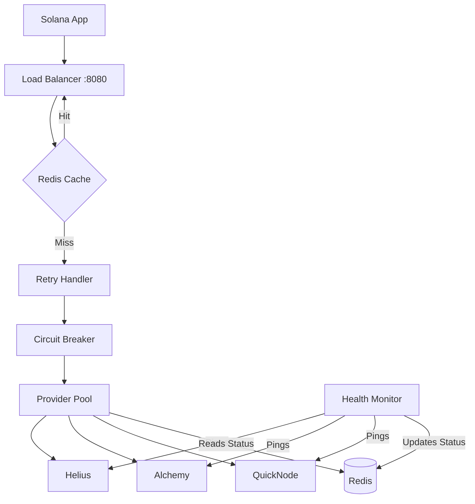

# Operations & Testing Guide: Solana RPC Load Balancer

This guide explains how the Load Balancer works, how to verify its features, and how to interpret its logs.

## 🏗️ Architecture Overview

The system acts as a transparent proxy between your Solana application and multiple RPC providers (Helius, Alchemy, QuickNodes).



### Core Components
- **Provider Pool**: Manages the list of endpoints and performs **Least-Latency Routing**.
- **Retry Handler**: Implements exponential backoff (100ms, 200ms, 400ms) across providers.
- **Circuit Breaker**: Temporarily disables a provider after 5 consecutive failures.
- **Health Monitor**: Runs in the background (every 5s) to check if providers are up.
- **Cache Handler**: Stores RPC responses in Redis to save costs and reduce latency.

---

## 🚀 How to Run

```bash
# 1. Provide API keys in .env
# 2. Start the entire stack
docker-compose up --build -d
```

---

## ✅ Feature Verification

### 1. Multi-Provider Routing
**Test**: Send 3 different requests.
**Verification**: Check logs for `[ROUTING]`. You should see it cycle through your providers.
```bash
curl -X POST http://localhost:8080 -d '{"jsonrpc":"2.0","id":1,"method":"getSlot"}'
```

### 2. Automatic Failover (Retries)
**Test**: Provide an invalid API key for one provider in `.env`.
**Verification**: Check logs for `[RETRY]`. The LB will fail on the first, then automatically succeed using the second provider.

### 3. Least-Latency Routing
**Test**: Observe routing after a few requests.
**Verification**: Look for `[ROUTING] Selected least-latency provider`. The system will "stick" to the fastest endpoint (usually Alchemy or Helius).

### 4. Request Caching
**Test**: Run the same command twice.
**Verification**: The second request should show `[CACHE] Hit` and a latency of `<1ms`.

---

## 📜 Log Interpretation

The logs are designed to be human-readable. Here is how to read them:

| Log Prefix | Meaning | Example |
|:---|:---|:---|
| `[ROUTING]` | Decision on which provider to use. | `Selected least-latency provider: alchemy (52ms)` |
| `[REQUEST]` | Result of an RPC call to a provider. | `method=getSlot provider=alchemy latency=58ms` |
| `[RETRY]` | A failure occurred, trying another provider. | `Attempt 1 failed for provider helius: 401 Unauthorized` |
| `[CIRCUIT-BREAKER]` | A provider is "tripped" and disabled. | `Provider helius state changed from Closed to Open` |
| `[CACHE]` | A response was served from Redis. | `Hit for method=getSlot id=1` |
| `[HEALTH]` | Result of background health checks. | `Provider helius is HEALTHY (slot: 391006814)` |
| `[HTTP]` | Entry point log (Standard Web Log). | `POST / | 200 | 58ms` |

---

## 📈 Monitoring

- **Prometheus Metrics**: `http://localhost:8080/metrics`
- **Health Status**: `http://localhost:8080/health`

### Key Metrics to watch:
- `rpc_requests_total`: Total volume.
- `rpc_request_duration_seconds`: Performance per provider.
- `rpc_errors_total`: Failure rates.
