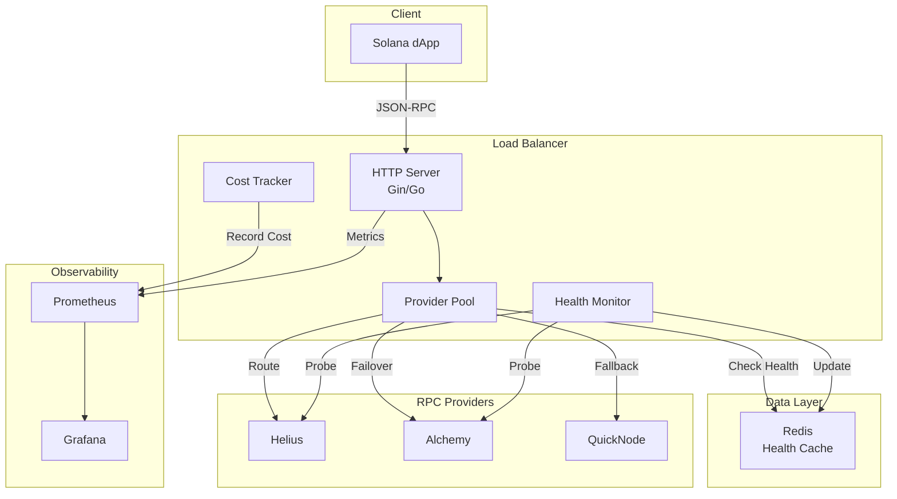

# Product Requirements Document (PRD)
## Solana RPC Load Balancer with Cost Optimizer

**Version:** 1.0  
**Date:** January 3, 2026  
**Status:** Draft - MVP Scope  
**Owner:** Engineering Team  

---

## Executive Summary

A self-hosted RPC load balancer for Solana that intelligently routes requests across multiple providers to optimize for cost, latency, and reliability. The MVP will enable teams to reduce RPC costs by 30-50% while improving uptime through automatic failover.

**Target Launch:** 6 weeks from kickoff  
**Initial Users:** 3-5 beta testers (Solana dApp developers)  
**Success Metric:** Demonstrated 30%+ cost savings with <50ms routing overhead

---

## 1. Problem Statement

### Current Challenges

Solana developers and teams face significant pain points with RPC infrastructure:

#### 1.1 Cost Unpredictability
- **Problem**: Solana priority fees fluctuate wildly (100x swings during congestion)
- **Impact**: Developers overpay by 40-60% to ensure transaction success
- **Example**: A DEX pays $15K/month but could optimize to $8K with intelligent routing

#### 1.2 Vendor Lock-In
- **Problem**: Teams rely on a single RPC provider (Helius, Alchemy, QuickNode)
- **Impact**: No failover when provider has downtime (2-3 incidents/month)
- **Example**: 30-minute Helius outage = complete dApp unavailability

#### 1.3 Manual Optimization
- **Problem**: Teams manually switch providers based on cost or performance
- **Impact**: Wastes engineering time, suboptimal decisions
- **Example**: 2-3 hours/week monitoring and adjusting configurations

#### 1.4 Poor Observability
- **Problem**: No unified view of RPC usage, costs, and performance across providers
- **Impact**: Billing surprises, inability to debug latency issues
- **Example**: "Why did our RPC bill jump 40% last month?"

---

## 2. Market Opportunity

### 2.1 Target Market Size

| Segment | Count | Avg RPC Spend/mo | TAM |
|---------|-------|------------------|-----|
| **Enterprise dApps** | 50 | $20,000 | $12M/year |
| **Mid-size Teams** | 200 | $5,000 | $12M/year |
| **Indie Developers** | 1,000 | $500 | $6M/year |
| **Total** | 1,250 | - | **$30M/year** |

**Serviceable Market:** Self-hosted solution targets enterprise + mid-size = **$24M/year**

### 2.2 Competitive Landscape

| Solution | Type | Strengths | Weaknesses | Pricing |
|----------|------|-----------|------------|---------|
| **Direct Provider** | Managed | Simple setup | Single point of failure, expensive | $0.0001-0.0003/req |
| **QuickNode Marketplace** | Managed Multi | Multiple providers | Still vendor-locked, costly | 10% markup |
| **Home-Grown** | DIY | Full control | High dev cost, poor observability | Engineering time |
| **Our Solution** | Self-Hosted | Cost control, multi-provider, observability | Requires infrastructure | Open source |

**Competitive Advantage**: Only open-source solution with ML-driven cost optimization and chaos-tested reliability.

---

## 3. User Personas

### Persona 1: "Cost-Conscious DevOps Engineer"

**Profile:**
- Works at mid-size Solana dApp (10-50 employees)
- Manages $5K-15K/month RPC spend
- Responsible for infrastructure costs and uptime

**Goals:**
- Reduce RPC costs by 30%+ without sacrificing reliability
- Unified observability across providers
- Automatic failover during outages

**Pain Points:**
- Manual provider switching is time-consuming
- Boss questions high RPC bills
- Last Helius outage caused customer complaints

**Success Criteria:**
- Deploy in <1 day
- See cost savings in first week
- Zero-touch failover during next provider incident

---

### Persona 2: "Reliability-Focused Backend Engineer"

**Profile:**
- Works at enterprise Solana protocol (100+ employees)
- 99.9% uptime SLA with users
- Manages complex multi-region architecture

**Goals:**
- Eliminate single points of failure
- Sub-100ms RPC latency (p95)
- Detailed request tracing for debugging

**Pain Points:**
- Provider outages violate SLAs
- Difficult to debug cross-provider latency issues
- No visibility into which RPC methods are expensive

**Success Criteria:**
- Automatic failover in <10 seconds
- Request tracing from client → provider → response
- Alerts when p95 latency exceeds threshold

---

### Persona 3: "Indie Solana Developer"

**Profile:**
- Solo or 2-3 person team
- $500-2K/month RPC budget
- Limited infra expertise

**Goals:**
- Save money on RPC without complexity
- Simple setup (Docker Compose)
- Basic monitoring dashboards

**Pain Points:**
- Can't afford enterprise solutions
- Don't have time to build custom tooling
- Provider bills are confusing

**Success Criteria:**
- Deploy with `docker-compose up`
- See live cost dashboard
- Set budget alerts ($100/day limit)

---

## 4. Product Goals & Objectives

### 4.1 MVP Goals (Weeks 1-6)

1. **Cost Reduction**
   - Achieve 30%+ cost savings through intelligent routing
   - Support 2-3 providers (Helius, Alchemy, QuickNode)
   - Basic cost tracking and forecasting

2. **Reliability**
   - Automatic failover when provider is unavailable
   - Detect provider failure within 10 seconds
   - Retry failed requests (exponential backoff)

3. **Observability**
   - Real-time Grafana dashboard (TPS, latency, cost)
   - Request/response logging
   - Provider health monitoring

4. **Ease of Use**
   - Deploy with Docker Compose in <30 minutes
   - YAML-based configuration
   - Basic documentation and examples

### 4.2 Success Metrics (MVP)

| Metric | Target | Measurement |
|--------|--------|-------------|
| **Cost Savings** | 30%+ | Compare to single-provider baseline |
| **Routing Overhead** | <50ms (p95) | Prometheus histogram |
| **Failover Time** | <10 seconds | Time to detect + reroute |
| **Throughput** | 1,000 req/s | k6 load test |
| **Time to Deploy** | <30 minutes | User onboarding test |
| **Beta User Satisfaction** | 4+/5 | Post-deployment survey |

### 4.3 Non-Goals (Out of Scope for MVP)

- ❌ AI/ML fee prediction (Phase 2)
- ❌ Multi-region HA deployment (Phase 2)
- ❌ Built-in security scanning (Phase 2)
- ❌ Request caching / deduplication (Phase 2)
- ❌ Multi-tenancy / SaaS offering (Phase 3)
- ❌ Custom provider plugins (Phase 3)

---

## 5. Functional Requirements

### 5.1 Core Features (Must-Have)

#### FR-1: Multi-Provider Routing
**Description**: Route RPC requests across 2+ configured providers

**Acceptance Criteria**:
- [ ] Support Helius, Alchemy, and QuickNode providers
- [ ] Round-robin routing strategy
- [ ] Exclude unhealthy providers from rotation
- [ ] Log each routing decision (provider selected, reason)

**User Story**: *"As a DevOps engineer, I want to configure multiple RPC providers so that I'm not dependent on a single vendor."*

---

#### FR-2: Health Monitoring
**Description**: Continuously monitor provider health and availability

**Acceptance Criteria**:
- [ ] Active health probes every 5 seconds (`getHealth`, `getSlot`)
- [ ] Track success rate and latency per provider
- [ ] Mark providers as healthy/degraded/down
- [ ] Store health status in Redis (5-second TTL)
- [ ] Expose health metrics to Prometheus

**User Story**: *"As a reliability engineer, I want automatic health checks so that unhealthy providers are removed from rotation."*

---

#### FR-3: Automatic Failover
**Description**: Retry failed requests on alternate providers

**Acceptance Criteria**:
- [ ] Max 3 retry attempts per request
- [ ] Exponential backoff (100ms, 200ms, 400ms)
- [ ] Return 4xx/5xx error after exhausting retries
- [ ] Circuit breaker opens after 5 consecutive failures
- [ ] Circuit breaker auto-recovers after 60 seconds

**User Story**: *"As a backend engineer, I want automatic retries so that transient provider errors don't fail my users' transactions."*

---

#### FR-4: Cost Tracking
**Description**: Track and display RPC costs per provider

**Acceptance Criteria**:
- [ ] Configure cost-per-request for each provider (YAML)
- [ ] Increment cost counter on each request
- [ ] Expose total cost metric to Prometheus
- [ ] Grafana panel showing cost over time
- [ ] Projected monthly cost estimate

**User Story**: *"As a CFO-minded engineer, I want to see real-time cost breakdown so that I can justify our infrastructure spend."*

---

#### FR-5: Observability Dashboard
**Description**: Grafana dashboard showing system health and performance

**Acceptance Criteria**:
- [ ] Panel 1: Requests per second (by provider)
- [ ] Panel 2: Latency percentiles (p50, p95, p99)
- [ ] Panel 3: Error rate (by provider, by RPC method)
- [ ] Panel 4: Provider health status (green/yellow/red)
- [ ] Panel 5: Total spent (USD, by provider)
- [ ] Dashboard auto-refreshes every 5 seconds

**User Story**: *"As an on-call engineer, I want a real-time dashboard so that I can diagnose issues quickly during incidents."*

---

### 5.2 Nice-to-Have Features (Post-MVP)

- **Least-Latency Routing**: Route to fastest provider based on recent latency
- **Rate Limiting**: Respect provider-specific rate limits
- **Request Caching**: Cache identical requests (e.g., `getLatestBlockhash`)
- **Webhook Alerts**: Slack/PagerDuty integration for failures
- **Multi-Region**: Deploy across AWS regions for HA

---

## 6. Non-Functional Requirements

### 6.1 Performance

| Requirement | Target | Rationale |
|-------------|--------|-----------|
| **Throughput** | 1,000 req/s | Support mid-size dApp traffic |
| **Latency (p95)** | <50ms overhead | Minimal impact on user experience |
| **Latency (p99)** | <100ms overhead | Acceptable for 99% of requests |
| **Provider Timeout** | 5 seconds | Fail fast if provider is slow |
| **Concurrent Connections** | 500 | Handle burst traffic |

### 6.2 Reliability

| Requirement | Target | Measurement |
|-------------|--------|-------------|
| **Uptime** | 99.9% | ~40 minutes downtime/month |
| **Failover Time** | <10 seconds | From detection to reroute |
| **Data Loss** | 0 requests | Use retries + logging |
| **Recovery Time** | <60 seconds | Circuit breaker auto-recovery |

### 6.3 Security

| Requirement | Implementation |
|-------------|----------------|
| **API Key Storage** | Environment variables or K8s Secrets |
| **TLS/HTTPS** | Support HTTPS endpoints for providers |
| **Rate Limiting** | Prevent abuse (1000 req/s per client IP) |
| **Audit Logging** | Log all requests (sanitize sensitive data) |

### 6.4 Scalability

| Requirement | MVP | Phase 2 |
|-------------|-----|---------|
| **Horizontal Scaling** | Single instance | K8s HPA (3-10 pods) |
| **Redis** | Single instance | Redis Cluster (3 nodes) |
| **Database** | File-based config | PostgreSQL |
| **Observability** | Local Prometheus | Thanos (long-term storage) |

### 6.5 Usability

| Requirement | Target | Verification |
|-------------|--------|--------------|
| **Time to Deploy** | <30 minutes | New user onboarding test |
| **Configuration** | YAML file | No code changes needed |
| **Documentation** | README + examples | 3-5 beta users can deploy |
| **Error Messages** | Human-readable | "Provider 'helius' is down" |

---

## 7. Technical Architecture (MVP)

### 7.1 System Components



### 7.2 Technology Stack

| Layer | Technology | Rationale |
|-------|-----------|-----------|
| **Language** | Go 1.21+ | High performance, strong concurrency |
| **Web Framework** | Gin | Popular, fast HTTP routing |
| **Cache** | Redis 7 | Sub-ms latency for health status |
| **Metrics** | Prometheus | Industry standard for K8s |
| **Dashboards** | Grafana | Best visualization tool |
| **Deployment** | Docker Compose | Simple MVP deployment |
| **Config** | YAML | Human-readable, version-controlled |

### 7.3 Data Models

#### Configuration (`config.yaml`)
```yaml
providers:
  - name: helius
    url: https://mainnet.helius-rpc.com/?api-key=${HELIUS_API_KEY}
    priority: 1
    cost_per_request: 0.0001
  
  - name: alchemy
    url: https://solana-mainnet.g.alchemy.com/v2/${ALCHEMY_API_KEY}
    priority: 2
    cost_per_request: 0.00012

routing:
  strategy: round-robin
  max_retries: 3
  retry_backoff: 100ms

health:
  check_interval: 5s
  timeout: 2s
  unhealthy_threshold: 3
```

#### Health Status (Redis)
```json
{
  "helius": {
    "status": "healthy",
    "last_check": "2026-01-03T12:00:00Z",
    "latency_ms": 45,
    "success_rate": 0.998
  }
}
```

---

## 8. User Stories & Use Cases

### UC-1: Deploy Load Balancer
**Actor**: DevOps Engineer  
**Precondition**: Has Docker and Docker Compose installed  

**Flow**:
1. Clone repository
2. Copy `.env.example` to `.env`
3. Add RPC provider API keys
4. Run `docker-compose up -d`
5. Access Grafana at `http://localhost:3000`

**Postcondition**: Load balancer is routing traffic, dashboard is visible

---

### UC-2: Handle Provider Failure
**Actor**: System (automated)  
**Trigger**: Helius API returns 503 errors  

**Flow**:
1. Health monitor detects 3 consecutive failures
2. Mark Helius as "down" in Redis
3. Provider pool excludes Helius from routing
4. New requests route to Alchemy
5. Continue probing Helius every 5 seconds
6. When Helius recovers, add back to rotation

**Postcondition**: Zero user-facing errors, automatic recovery

---

### UC-3: Monitor Costs
**Actor**: FinOps Engineer  
**Trigger**: Weekly cost review  

**Flow**:
1. Open Grafana dashboard
2. View "Total Cost" panel (time series)
3. See breakdown: Helius $400, Alchemy $300
4. Export CSV for reporting
5. Set budget alert ($1000/week threshold)

**Postcondition**: Cost visibility and alerting enabled

---

### UC-4: Debug Latency Spike
**Actor**: Backend Engineer  
**Trigger**: Users report slow transactions  

**Flow**:
1. Open Grafana dashboard
2. Check "Latency Percentiles" panel
3. See p95 latency spiked to 800ms
4. Drill down: All requests to QuickNode
5. Check "Provider Health" panel: QuickNode degraded
6. Manually disable QuickNode in config
7. Restart load balancer

**Postcondition**: Latency returns to normal, root cause identified

---

## 9. Success Criteria & KPIs

### 9.1 MVP Launch Criteria

Before declaring MVP "done", must achieve:

- [x] **Functional**
  - Routes 1,000+ req/s with <50ms overhead
  - Supports 2+ providers (tested with Helius + Alchemy)
  - Automatic failover in <10 seconds
  - Grafana dashboard with 5+ panels

- [x] **Quality**
  - 80%+ unit test coverage
  - Load test passes (1,000 req/s for 5 minutes)
  - Failover test passes (kill provider, verify reroute)
  - Documentation complete (README, architecture diagram)

- [x] **User Validation**
  - 3 beta users successfully deploy
  - 2/3 users report cost savings
  - No P0 bugs reported

### 9.2 Key Performance Indicators

#### Week 2 Checkpoint
- [ ] Single-provider routing works (100 req/s)
- [ ] Basic health checks implemented
- [ ] Redis integration complete

#### Week 4 Checkpoint
- [ ] Multi-provider routing (2 providers)
- [ ] Automatic failover tested
- [ ] Prometheus metrics exporting

#### Week 6 Launch
- [ ] Full observability stack (Prometheus + Grafana)
- [ ] Docker Compose deployment tested
- [ ] 3 beta users onboarded
- [ ] Cost savings demonstrated (30%+ vs baseline)

---

## 10. Timeline & Milestones

### Week 1: Foundation (Jan 6-12)
**Goal**: Basic HTTP server routing to single provider

- [ ] Setup Go project structure
- [ ] Create HTTP server (Gin)
- [ ] Implement provider abstraction
- [ ] Forward requests to Helius
- [ ] Basic logging

**Deliverable**: Server that proxies to one provider

---

### Week 2: Multi-Provider (Jan 13-19)
**Goal**: Route across 2 providers with health checks

- [ ] Add provider pool (round-robin)
- [ ] Implement health probes
- [ ] Integrate Redis for health cache
- [ ] Background health monitoring

**Deliverable**: Load balancing with health filtering

---

### Week 3: Resilience (Jan 20-26)
**Goal**: Retry logic and error handling

- [ ] Circuit breaker pattern
- [ ] Exponential backoff retries
- [ ] Error response mapping
- [ ] Integration tests

**Deliverable**: Robust request handling

---

### Week 4: Observability (Jan 27-Feb 2)
**Goal**: Metrics and dashboards

- [ ] Add Prometheus instrumentation
- [ ] Setup Prometheus + Grafana (Docker)
- [ ] Create Grafana dashboard (5 panels)
- [ ] Alert rules (optional)

**Deliverable**: Live observability dashboard

---

### Week 5: Cost & Deployment (Feb 3-9)
**Goal**: Cost tracking and containerization

- [ ] Basic cost calculation
- [ ] Cost dashboard panel
- [ ] Dockerfile + Docker Compose
- [ ] Configuration guide

**Deliverable**: Fully containerized system

---

### Week 6: Testing & Launch (Feb 10-16)
**Goal**: Polish and beta deployment

- [ ] Integration tests
- [ ] Load testing (k6)
- [ ] Documentation (README, examples)
- [ ] Beta user onboarding (3 users)
- [ ] Demo video/screenshots

**Deliverable**: MVP-ready product

---

## 11. Risks & Mitigation

### Risk 1: Provider API Changes
**Probability**: Medium  
**Impact**: High  
**Mitigation**: 
- Monitor provider changelog/status pages
- Implement version checks
- Maintain provider adapter pattern for isolation

---

### Risk 2: Performance Bottlenecks
**Probability**: Low  
**Impact**: High  
**Mitigation**:
- Load test early (Week 3)
- Use Go profiling tools (pprof)
- Benchmark critical code paths

---

### Risk 3: User Adoption
**Probability**: Medium  
**Impact**: Medium  
**Mitigation**:
- Target 3-5 beta users before public launch
- Create video tutorial for onboarding
- Join Solana Discord to share project

---

### Risk 4: Security Vulnerabilities
**Probability**: Medium  
**Impact**: High  
**Mitigation**:
- Use environment variables for secrets
- Regular dependency updates
- Basic input validation (sanitize logs)

---

## 12. Open Questions

| # | Question | Owner | Target Date |
|---|----------|-------|-------------|
| 1 | Which provider should be default priority? | Engineering | Week 1 |
| 2 | Should we support custom provider plugins? | Product | Week 4 |
| 3 | What's the threshold for "degraded" provider? | SRE | Week 2 |
| 4 | Do we need request/response caching in MVP? | Engineering | Week 3 |
| 5 | Should we support Kubernetes deployment in MVP? | DevOps | Week 5 |

---

## 13. Appendix

### 13.1 Reference Documents

- [MVP Implementation Guide](file:///Users/prateekkanurkar/Documents/DeNova/rpc-load-balancer/mvp-rpc-load-balancer.md)
- [Tech Stack Recommendations](file:///Users/prateekkanurkar/Documents/DeNova/tech-stack-recommendations.md)
- [Solana RPC Spec](https://solana.com/docs/rpc)

### 13.2 Glossary

- **RPC**: Remote Procedure Call (API interface for Solana)
- **Provider**: Third-party RPC service (Helius, Alchemy, QuickNode)
- **Priority Fee**: Dynamic fee users pay for transaction priority
- **Load Balancer**: System that distributes requests across multiple backends
- **Circuit Breaker**: Pattern to prevent cascading failures
- **Observability**: Ability to understand system state from outputs (metrics, logs, traces)

### 13.3 Approval Sign-Off

| Role | Name | Date | Signature |
|------|------|------|-----------|
| **Product Owner** | TBD | - | - |
| **Engineering Lead** | TBD | - | - |
| **DevOps Lead** | TBD | - | - |

---

**Document Status**: ✅ Ready for Review  
**Next Steps**: Review PRD with team, gather feedback, begin Week 1 implementation

