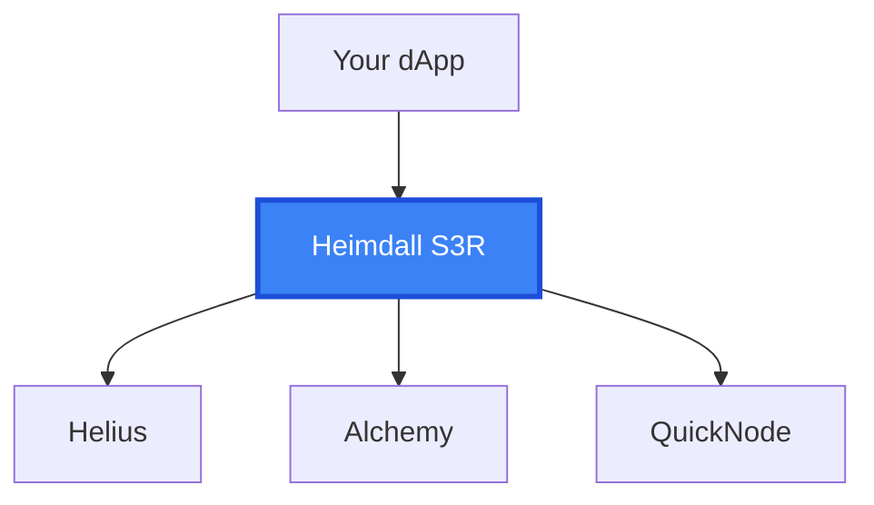
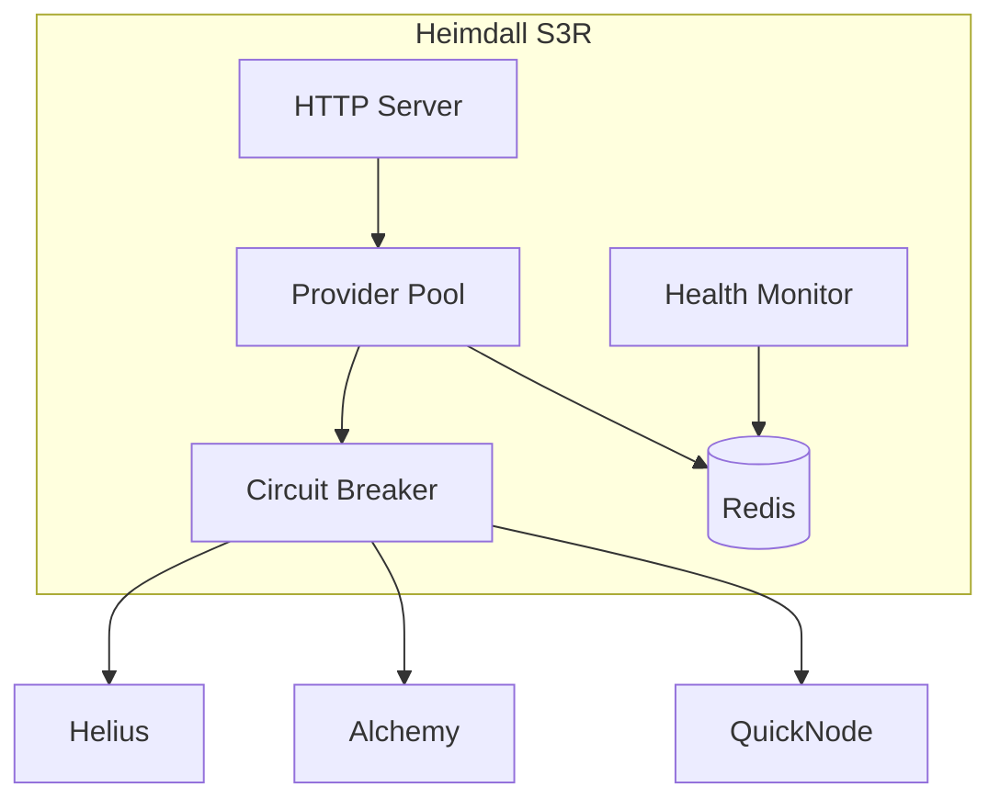

# Heimdall S3R

**Smart RPC Reliability Router Dashboard for Solana**

Heimdall S3R is a high-performance middleware that intelligently routes Solana RPC requests across multiple providers (Helius, Alchemy, QuickNode) to optimize for cost, latency, and reliability.



## 🚀 Key Features

| Feature | Benefit |
|---------|---------|
| **Multi-Provider Pool** | No vendor lock-in, instant failover |
| **Auto-Failover** | Sub-10s detection and rerouting |
| **Cost Optimization** | Save up to 50% on RPC bills |
| **Full Observability** | Real-time Grafana dashboards |

## 📦 Quick Start

### Docker Compose (Recommended)

```bash
git clone https://github.com/KanurkarPrateek/rpc-load-balancer.git
cd rpc-load-balancer

cp .env.example .env
# Add your provider API keys to .env

docker-compose up -d
```

### Verify

```bash
curl http://localhost:8080/health
```

## 🔌 dApp Integration

Point your Solana client to Heimdall:

```typescript
import { Connection } from '@solana/web3.js';

// Instead of: new Connection('https://mainnet.helius-rpc.com/...')
const connection = new Connection('http://localhost:8080');

// Use normally
const balance = await connection.getBalance(publicKey);
```

## 🏗️ Architecture



## ☸️ Deployment Options

| Method | Best For |
|--------|----------|
| **Docker Compose** | Development, small deployments |
| **Kubernetes** | Production, high availability |

See [Full Documentation](https://kanurkarprateek.github.io/rpc-load-balancer/) for detailed deployment guides.

## 📖 Documentation

- [Getting Started](docs/index.html#getting-started)
- [Architecture](docs/index.html#architecture)
- [dApp Integration](docs/index.html#dapp-integration)
- [Docker Deployment](docs/index.html#docker-deployment)
- [Kubernetes Deployment](docs/index.html#kubernetes)
- [API Reference](docs/index.html#api)

## 🔧 Configuration

| Variable | Description |
|----------|-------------|
| `HELIUS_API_KEY` | Helius RPC API Key |
| `ALCHEMY_API_KEY` | Alchemy RPC API Key |
| `QUICKNODE_TOKEN` | QuickNode Token |
| `REDIS_URL` | Redis connection URL |

## 📊 Observability

Access the dashboard at `http://localhost:80` after starting Docker Compose.

## 🤝 Contributing

Contributions welcome! See [Contributing Guide](CONTRIBUTING.md).

## 📄 License

MIT License © 2026
