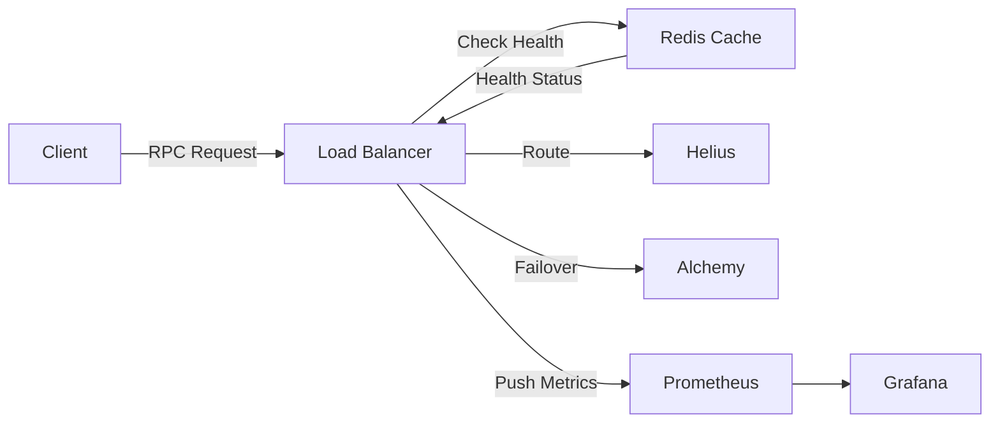

# RPC Load Balancer - MVP Implementation Guide

## MVP Goal

Build a **functional self-hosted RPC load balancer** that can route Solana RPC requests across 2-3 providers with basic health monitoring and observability. Target: **4-6 weeks** for a working prototype.

---

## Core Features (Must-Have)

### 1. Basic Request Routing ⭐
**What**: Accept RPC requests and route to healthy providers

**Why**: Core functionality - without this, nothing else matters

**Implementation**:
- HTTP server accepting JSON-RPC requests
- Provider pool (Helius, Alchemy, QuickNode)
- Round-robin or least-latency routing
- Retry logic on failures

**Success Criteria**:
- Route 1000+ req/s with <50ms overhead
- Auto-failover if provider is down

---

### 2. Health Monitoring ⭐
**What**: Continuously check provider health

**Why**: Ensure requests only go to healthy providers

**Implementation**:
- Active probing every 5 seconds (`getHealth`, `getSlot`)
- Track success rate and latency
- Mark providers as healthy/degraded/down
- Update routing weights dynamically

**Success Criteria**:
- Detect provider failure within 10 seconds
- Automatically remove from rotation

---

### 3. Basic Observability ⭐
**What**: Metrics and dashboards for monitoring

**Why**: Understand system performance and cost

**Implementation**:
- Prometheus metrics (latency, error rate, provider distribution)
- Grafana dashboard (3-4 key panels)
- Request/response logging

**Success Criteria**:
- Real-time dashboard showing TPS and latency
- Track cost per provider

---

## Features to Skip (Post-MVP)

| Feature | Why Skip for MVP | Add in Phase |
|---------|------------------|--------------|
| AI Fee Prediction | Complex ML pipeline, needs data | Phase 2 |
| Multi-region HA | Adds operational complexity | Phase 2 |
| Security Scanning | Important but not blocking | Phase 2 |
| Request Caching | Optimization, not core | Phase 2 |
| Multi-tenancy | No customers yet | Phase 3 |

---

## MVP Tech Stack (Simplified)

### Core
- **Language**: Go 1.21+
- **Framework**: Gin or net/http (standard library)
- **Deployment**: Docker Compose (K8s in Phase 2)

### Data
- **Cache**: Redis (single instance)
- **Config**: YAML file (Postgres in Phase 2)

### Observability
- **Metrics**: Prometheus
- **Dashboards**: Grafana
- **Logs**: Stdout → Loki (optional)

### Providers (Start with 2)
- Helius (primary)
- Alchemy (fallback)

---

## System Architecture (MVP)



**Simplified from Production**:
- Single load balancer instance (no HA)
- Redis single node (no cluster)
- No AI/ML components
- Manual provider configuration

---

## Week-by-Week Build Plan

### Week 1: Foundation & Routing

**Goal**: Basic HTTP server that routes to one provider

**Tasks**:
1. **Setup Go Project**
   ```bash
   mkdir rpc-load-balancer
   cd rpc-load-balancer
   go mod init github.com/yourname/rpc-load-balancer
   ```

2. **Create HTTP Server**
   ```go
   // main.go
   package main
   
   import (
       "github.com/gin-gonic/gin"
   )
   
   func main() {
       r := gin.Default()
       r.POST("/", handleRPCRequest)
       r.Run(":8080")
   }
   ```

3. **Provider Abstraction**
   ```go
   // pkg/provider/provider.go
   type Provider interface {
       Name() string
       URL() string
       ForwardRequest(req *RPCRequest) (*RPCResponse, error)
   }
   ```

4. **Single Provider Routing**
   - Forward request to Helius
   - Return response to client
   - Log request/response

**Deliverable**: Server that proxies to Helius

**Test**:
```bash
curl -X POST http://localhost:8080 \
  -H "Content-Type: application/json" \
  -d '{"jsonrpc":"2.0","id":1,"method":"getLatestBlockhash"}'
```

---

### Week 2: Multi-Provider & Basic Health

**Goal**: Route across 2 providers with simple health checks

**Tasks**:
1. **Add Provider Pool**
   ```go
   // pkg/pool/pool.go
   type ProviderPool struct {
       providers []Provider
       current   int
   }
   
   func (p *ProviderPool) Next() Provider {
       // Round-robin logic
   }
   ```

2. **Implement Health Probe**
   ```go
   // pkg/health/monitor.go
   func ProbeProvider(provider Provider) HealthStatus {
       // Call getHealth RPC
       // Return healthy/unhealthy
   }
   ```

3. **Background Health Checking**
   ```go
   // Run in goroutine
   ticker := time.NewTicker(5 * time.Second)
   for range ticker.C {
       for _, provider := range providers {
           status := health.ProbeProvider(provider)
           cache.SetHealth(provider.Name(), status)
       }
   }
   ```

4. **Integrate Redis**
   ```go
   import "github.com/go-redis/redis/v8"
   
   func getHealthyProviders() []Provider {
       // Query Redis for healthy providers
   }
   ```

**Deliverable**: Round-robin routing with health-based filtering

**Test**:
- Send 100 requests, verify distribution
- Kill Helius API key, verify automatic failover to Alchemy

---

### Week 3: Retry Logic & Error Handling

**Goal**: Robust request handling with retries

**Tasks**:
1. **Circuit Breaker Pattern**
   ```go
   // Use github.com/sony/gobreaker
   cb := gobreaker.NewCircuitBreaker(gobreaker.Settings{
       Name:        "Helius",
       MaxRequests: 3,
       Timeout:     time.Second * 60,
   })
   ```

2. **Exponential Backoff Retries**
   ```go
   // pkg/router/retry.go
   func retryRequest(req *RPCRequest, maxRetries int) (*RPCResponse, error) {
       backoff := 100 * time.Millisecond
       for i := 0; i < maxRetries; i++ {
           resp, err := forwardRequest(req)
           if err == nil {
               return resp, nil
           }
           time.Sleep(backoff)
           backoff *= 2  // Exponential
       }
       return nil, errors.New("max retries exceeded")
   }
   ```

3. **Error Response Handling**
   - Parse provider errors
   - Map to appropriate HTTP status codes
   - Log failures for debugging

**Deliverable**: Resilient routing with auto-retry

**Test**:
- Simulate provider 500 errors
- Verify retries with backoff
- Check circuit breaker opens after threshold

---

### Week 4: Observability (Prometheus + Grafana)

**Goal**: Metrics and dashboards for visibility

**Tasks**:
1. **Add Prometheus Metrics**
   ```go
   import "github.com/prometheus/client_golang/prometheus"
   
   var (
       requestsTotal = prometheus.NewCounterVec(
           prometheus.CounterOpts{
               Name: "rpc_requests_total",
           },
           []string{"provider", "method", "status"},
       )
       
       requestDuration = prometheus.NewHistogramVec(
           prometheus.HistogramOpts{
               Name:    "rpc_request_duration_seconds",
               Buckets: []float64{.01, .05, .1, .5, 1, 2},
           },
           []string{"provider"},
       )
   )
   ```

2. **Instrument Code**
   ```go
   func handleRPCRequest(c *gin.Context) {
       start := time.Now()
       
       // ... forward request ...
       
       requestsTotal.WithLabelValues(provider, method, "success").Inc()
       requestDuration.WithLabelValues(provider).Observe(time.Since(start).Seconds())
   }
   ```

3. **Setup Prometheus**
   ```yaml
   # docker-compose.yml
   prometheus:
     image: prom/prometheus
     ports:
       - "9090:9090"
     volumes:
       - ./prometheus.yml:/etc/prometheus/prometheus.yml
   ```

4. **Create Grafana Dashboard**
   - Panel 1: Requests per second by provider
   - Panel 2: Latency percentiles (p50, p95, p99)
   - Panel 3: Error rate
   - Panel 4: Provider health status

**Deliverable**: Live dashboard showing system metrics

**Test**:
- Send load (1000 req/s)
- Verify metrics update in real-time

---

### Week 5: Cost Tracking & Docker Deployment

**Goal**: Track costs and containerize application

**Tasks**:
1. **Basic Cost Calculation**
   ```go
   // pkg/cost/tracker.go
   var providerCosts = map[string]float64{
       "helius":  0.0001,  // per request
       "alchemy": 0.00012,
   }
   
   func recordCost(provider string) {
       cost := providerCosts[provider]
       totalCost.WithLabelValues(provider).Add(cost)
   }
   ```

2. **Cost Dashboard Panel**
   - Total spend by provider (gauge)
   - Projected monthly cost (forecast)
   - Cost per 1000 requests

3. **Dockerfile**
   ```dockerfile
   FROM golang:1.21 AS builder
   WORKDIR /app
   COPY . .
   RUN go build -o rpc-balancer ./cmd/server
   
   FROM alpine:latest
   COPY --from=builder /app/rpc-balancer /usr/local/bin/
   EXPOSE 8080
   CMD ["rpc-balancer"]
   ```

4. **Docker Compose**
   ```yaml
   version: '3.8'
   services:
     load-balancer:
       build: .
       ports:
         - "8080:8080"
       environment:
         - REDIS_URL=redis:6379
       depends_on:
         - redis
     
     redis:
       image: redis:7-alpine
       ports:
         - "6379:6379"
     
     prometheus:
       image: prom/prometheus
       ports:
         - "9090:9090"
       volumes:
         - ./prometheus.yml:/etc/prometheus/prometheus.yml
     
     grafana:
       image: grafana/grafana
       ports:
         - "3000:3000"
   ```

**Deliverable**: Fully containerized system

**Deploy**:
```bash
docker-compose up -d
```

---

### Week 6: Testing, Documentation & Demo

**Goal**: Polish MVP for demo/feedback

**Tasks**:
1. **Integration Tests**
   ```go
   // tests/integration_test.go
   func TestLoadBalancing(t *testing.T) {
       // Send 100 requests
       // Verify distribution across providers
   }
   
   func TestFailover(t *testing.T) {
       // Disable Helius
       // Verify requests go to Alchemy
   }
   ```

2. **Load Testing**
   ```bash
   # Use k6
   k6 run --vus 100 --duration 30s load-test.js
   ```

3. **Documentation**
   ```markdown
   # README.md
   
   ## Quick Start
   1. Clone repo
   2. Add API keys to .env
   3. docker-compose up -d
   4. Access Grafana at http://localhost:3000
   
   ## Configuration
   - Provider URLs
   - Health check interval
   - Retry settings
   ```

4. **Demo Video/Screenshots**
   - Record Grafana dashboard during load test
   - Show automatic failover
   - Cost savings visualization

**Deliverable**: Demo-ready MVP

---

## Project Structure

```
rpc-load-balancer/
├── cmd/
│   └── server/
│       └── main.go              # Application entry point
├── pkg/
│   ├── provider/
│   │   ├── provider.go          # Provider interface
│   │   ├── helius.go            # Helius implementation
│   │   └── alchemy.go           # Alchemy implementation
│   ├── pool/
│   │   └── pool.go              # Provider pool & routing
│   ├── health/
│   │   └── monitor.go           # Health checking
│   ├── router/
│   │   ├── handler.go           # HTTP request handler
│   │   └── retry.go             # Retry logic
│   └── metrics/
│       └── prometheus.go        # Metrics instrumentation
├── config/
│   └── config.yaml              # Configuration file
├── tests/
│   ├── integration_test.go
│   └── load-test.js             # k6 script
├── docker-compose.yml
├── Dockerfile
├── prometheus.yml               # Prometheus config
├── go.mod
├── go.sum
└── README.md
```

---

## Configuration (config.yaml)

```yaml
server:
  port: 8080
  readTimeout: 30s
  writeTimeout: 30s

providers:
  - name: helius
    url: https://mainnet.helius-rpc.com/?api-key=${HELIUS_API_KEY}
    priority: 1
    cost_per_request: 0.0001
  
  - name: alchemy
    url: https://solana-mainnet.g.alchemy.com/v2/${ALCHEMY_API_KEY}
    priority: 2
    cost_per_request: 0.00012

health:
  check_interval: 5s
  timeout: 2s
  unhealthy_threshold: 3

routing:
  strategy: round-robin  # or least-latency
  max_retries: 3
  retry_backoff: 100ms

redis:
  url: redis://localhost:6379
  db: 0
```

---

## Success Criteria (MVP)

### Functional Requirements
- [x] Route 1000+ requests/second
- [x] Support 2+ providers (Helius, Alchemy)
- [x] Automatic failover on provider failure
- [x] Health checks every 5 seconds
- [x] Retry failed requests (max 3 attempts)

### Performance
- [x] Request overhead <50ms (p95)
- [x] Detect provider failure within 10 seconds
- [x] Recover automatically when provider returns

### Observability
- [x] Grafana dashboard with 4+ panels
- [x] Real-time metrics (TPS, latency, errors)
- [x] Cost tracking per provider

### Operations
- [x] Deploy with `docker-compose up`
- [x] Configuration via YAML file
- [x] Basic documentation (README)

---

## Testing the MVP

### 1. Functional Test
```bash
# Send single request
curl -X POST http://localhost:8080 \
  -H "Content-Type: application/json" \
  -d '{"jsonrpc":"2.0","id":1,"method":"getLatestBlockhash"}'
```

### 2. Load Test (k6)
```javascript
// load-test.js
import http from 'k6/http';

export let options = {
  stages: [
    { duration: '30s', target: 100 },
    { duration: '1m', target: 100 },
    { duration: '30s', target: 0 },
  ],
};

export default function () {
  const payload = JSON.stringify({
    jsonrpc: '2.0',
    id: 1,
    method: 'getLatestBlockhash',
  });

  http.post('http://localhost:8080', payload, {
    headers: { 'Content-Type': 'application/json' },
  });
}
```

Run: `k6 run load-test.js`

### 3. Failover Test
```bash
# Invalidate Helius API key
# Send requests
# Verify all go to Alchemy
# Restore Helius key
# Verify traffic returns
```

### 4. Grafana Verification
- Open http://localhost:3000
- Check dashboard shows:
  - TPS ~100 req/s
  - Latency p95 <200ms
  - Provider distribution (50/50 if both healthy)
  - $0.XX estimated hourly cost

---

## Estimated Costs (MVP)

### Infrastructure (Monthly)
- **Local Development**: $0 (Docker Compose)
- **Cloud Deployment** (single EC2 t3.medium): ~$30
- **Redis** (t3.micro): ~$10
- **Total**: **$40/month**

### Provider Costs (Example)
- **10M requests/month** at avg $0.0001/req = $1,000
- **With load balancing** (optimized): ~$700
- **Monthly savings**: $300 (30%)

---

## Common Issues & Solutions

### Issue 1: Provider Rate Limits
**Symptom**: 429 errors from provider

**Solution**:
```go
// Add rate limiter per provider
import "golang.org/x/time/rate"

limiter := rate.NewLimiter(100, 200)  // 100 req/s, burst 200
limiter.Wait(ctx)
```

### Issue 2: Redis Connection Failures
**Symptom**: Health checks not updating

**Solution**:
```go
// Add connection retry logic
func connectRedis() *redis.Client {
    for i := 0; i < 5; i++ {
        client := redis.NewClient(&redis.Options{
            Addr: redisURL,
        })
        if err := client.Ping(ctx).Err(); err == nil {
            return client
        }
        time.Sleep(time.Second * 2)
    }
    panic("failed to connect to Redis")
}
```

### Issue 3: High Latency
**Symptom**: p95 latency >500ms

**Debug**:
```go
// Add per-hop timing
providerLatency := time.Now()
resp, err := provider.Forward(req)
log.Printf("Provider %s latency: %v", provider.Name(), time.Since(providerLatency))
```

---

## Post-MVP Roadmap

### Phase 2 (Weeks 7-12)
- [ ] Add 3rd provider (QuickNode)
- [ ] Implement least-latency routing
- [ ] Add request caching (duplicate detection)
- [ ] Kubernetes deployment (Helm chart)
- [ ] PostgreSQL for persistent config

### Phase 3 (Months 4-6)
- [ ] AI fee prediction (LightGBM model)
- [ ] Security scanning (API key leaks)
- [ ] Multi-region deployment
- [ ] Advanced dashboards (cost forecasting)

---

## Demo Script (5 minutes)

**Goal**: Show value to potential users

1. **Problem Statement** (30 sec)
   - "Solana devs lose money and uptime relying on single RPC provider"

2. **Solution Demo** (2 min)
   - Show Grafana dashboard
   - Send load (k6 test running)
   - Point out metrics: TPS, latency, cost

3. **Failover Demo** (1 min)
   - Invalidate one provider's API key
   - Show automatic failover in dashboard
   - "No downtime, requests still flowing"

4. **Cost Savings** (30 sec)
   - Show cost panel
   - "30% savings by routing to cheaper provider"

5. **Easy Setup** (1 min)
   - Show docker-compose.yml
   - "`docker-compose up` and you're running"

---

## Next Steps After MVP

1. **Get Feedback**: Deploy to 3-5 beta users
2. **Measure**: Track actual cost savings, latency improvements
3. **Iterate**: Add most-requested features
4. **Scale**: Move to Kubernetes, add HA
5. **Monetize**: Offer managed SaaS version

---

**Ready to build? Start with Week 1!** 🚀
