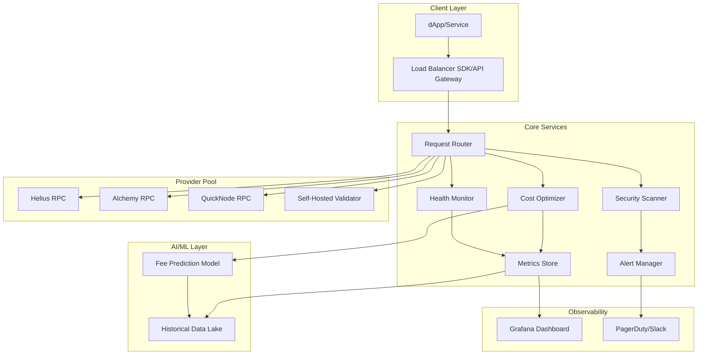
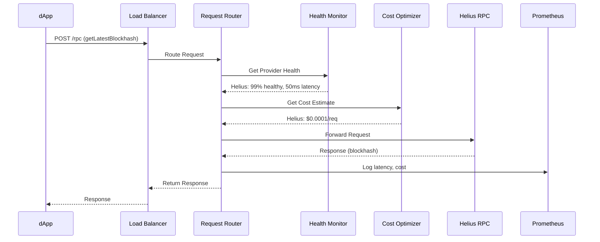

# Decentralized RPC Load Balancer with Cost Optimizer

## Executive Summary

A production-grade, self-hosted RPC load balancer for Solana that intelligently routes requests across multiple providers (Helius, Alchemy, QuickNode, etc.) based on real-time health metrics, cost optimization, and security monitoring. This tool addresses the critical pain point of unreliable/expensive RPC infrastructure that forces developers to manually manage multiple providers.

**Key Value Propositions:**
- **Cost Savings**: 30-50% reduction in RPC costs through intelligent routing
- **High Availability**: 99.9% uptime via automatic failover across providers
- **Security**: Built-in API key leak detection and DDoS protection
- **Observability**: Real-time dashboards for cost, performance, and health metrics

---

## Problem Statement

### Current Pain Points
1. **Rate Limits**: Single provider dependencies lead to throttling during traffic spikes
2. **Downtime**: Provider outages cause application failures
3. **Cost Inefficiency**: No automatic routing to cheaper/faster providers
4. **Security Risks**: API keys exposed in client-side code or leaked via logs
5. **Lack of Visibility**: No unified metrics across multiple providers

### Target Users
- **Infra Teams**: Managing production dApps requiring 99.9%+ uptime
- **DeFi Protocols**: High-throughput applications with cost constraints
- **Gaming Studios**: Real-time applications needing low-latency RPC access
- **Enterprise Blockchain Teams**: Organizations requiring compliance and security

---

## High-Level Architecture



---

## Detailed Component Design

### 1. Request Router (Core Engine)

**Responsibilities:**
- Receive incoming RPC requests
- Select optimal provider based on routing policies
- Execute request with retry logic
- Return response to client

**Routing Strategies:**
```go
type RoutingStrategy string

const (
    RoundRobin     RoutingStrategy = "round-robin"
    LeastLatency   RoutingStrategy = "least-latency"
    CostOptimized  RoutingStrategy = "cost-optimized"
    WeightedHealth RoutingStrategy = "weighted-health"
    GeoBased       RoutingStrategy = "geo-based"
)
```

**Key Features:**
- **Circuit Breaker Pattern**: Automatically remove failing providers
- **Request Deduplication**: Cache identical requests within short time windows
- **Priority Queuing**: VIP traffic lanes for critical requests
- **Rate Limit Awareness**: Track per-provider quotas and throttle accordingly

**Tech Stack:**
- **Language**: Go (high performance, excellent concurrency)
- **Framework**: Gin or Fiber for HTTP routing
- **Load Balancing Library**: Custom implementation with `weightedhash` or `consistent-hashing`

---

### 2. Health Monitor

**Responsibilities:**
- Continuously probe provider health (latency, success rate, block height)
- Detect network partitions or stale data
- Update routing weights in real-time

**Health Metrics:**
```go
type ProviderHealth struct {
    Name           string
    Latency        time.Duration
    SuccessRate    float64
    BlockHeight    uint64
    LastCheckTime  time.Time
    Status         HealthStatus // Healthy, Degraded, Down
}
```

**Probing Strategy:**
- **Active Probes**: Send `getHealth` + `getSlot` every 5 seconds
- **Passive Monitoring**: Track actual request success/failure rates
- **Block Height Verification**: Ensure provider is not lagging (tolerance: 3 blocks)

**Tech Stack:**
- **Probing**: Go routines with ticker
- **Storage**: Redis (TTL-based health cache)

---

### 3. Cost Optimizer (AI-Driven)

**Responsibilities:**
- Track cost per request for each provider
- Predict priority fees for optimal transaction inclusion
- Route requests to minimize total cost while maintaining SLAs

**Cost Calculation:**
```
Total Cost = (Fixed Cost per Request × Request Count) + 
             (Priority Fee × Transaction Count) +
             (Data Transfer Costs)
```

**AI Model for Fee Prediction:**
- **Input Features**: 
  - Time of day (UTC)
  - Recent block congestion (transactions/block)
  - Network TPS
  - Validator leader schedule
- **Model**: LightGBM or XGBoost trained on historical Solana fee data
- **Output**: Recommended priority fee (lamports) with confidence interval
- **Training Data Source**: Helius Fee API, on-chain transaction parsing

**Tech Stack:**
- **ML Framework**: Python (scikit-learn, LightGBM)
- **Model Serving**: TorchServe or FastAPI
- **Feature Store**: Redis or PostgreSQL with TimescaleDB extension

---

### 4. Security Scanner

**Responsibilities:**
- Detect API key leaks in logs or responses
- Monitor for DDoS patterns (unusual traffic spikes)
- Enforce encrypted connections (TLS 1.3+)
- Audit trails for compliance

**Security Features:**
```yaml
Security Modules:
  - API Key Rotation: Automatic rotation every 90 days
  - Encryption: All requests/responses encrypted via TLS
  - Rate Limiting: Per-IP and per-API-key limits
  - Anomaly Detection: ML-based traffic pattern analysis
  - Audit Logs: Immutable logs stored in S3/GCS
```

**Tech Stack:**
- **Secrets Management**: HashiCorp Vault or AWS Secrets Manager
- **WAF**: Cloudflare or AWS WAF for DDoS protection
- **SIEM**: Elastic Security or Splunk for log analysis

---

### 5. Observability & Dashboards

**Key Metrics:**
```yaml
Performance Metrics:
  - Request Latency (p50, p95, p99)
  - Requests per Second
  - Error Rate by Provider
  - Circuit Breaker Trips

Cost Metrics:
  - Cost per Request
  - Total Monthly Spend
  - Savings vs. Single Provider

Business Metrics:
  - Uptime %
  - SLA Compliance
  - Provider Distribution
```

**Dashboard Stack:**
- **Metrics Storage**: Prometheus (time-series database)
- **Visualization**: Grafana with custom dashboards
- **Alerting**: Alertmanager → PagerDuty/Slack

**Example Grafana Panel:**
```json
{
  "title": "Cost Savings Over Time",
  "type": "graph",
  "targets": [
    {
      "expr": "sum(rpc_cost_total{provider!='optimized'}) - sum(rpc_cost_total{provider='optimized'})"
    }
  ]
}
```

---

## Technology Stack

### Core Infrastructure
| Component | Technology | Rationale |
|-----------|-----------|-----------|
| **Load Balancer** | Go + Gin/Fiber | High throughput, low latency, excellent concurrency |
| **Cache Layer** | Redis Cluster | Fast provider health & response caching |
| **Database** | PostgreSQL + TimescaleDB | Time-series metrics, transactional data |
| **Message Queue** | RabbitMQ or Kafka | Async task processing (health checks, analytics) |

### AI/ML Pipeline
| Component | Technology | Rationale |
|-----------|-----------|-----------|
| **Training** | Python (LightGBM) | Industry-standard for tabular data prediction |
| **Model Serving** | FastAPI or TorchServe | Low-latency inference API |
| **Feature Engineering** | Pandas + dask | Large-scale data processing |
| **Data Lake** | S3 + Parquet | Cost-effective historical data storage |

### Observability
| Component | Technology | Rationale |
|-----------|-----------|-----------|
| **Metrics** | Prometheus | De facto standard for metrics collection |
| **Logs** | Loki or ELK Stack | Centralized logging with search |
| **Tracing** | Jaeger or Tempo | Distributed request tracing |
| **Dashboards** | Grafana | Best-in-class visualization |

### Deployment
| Component | Technology | Rationale |
|-----------|-----------|-----------|
| **Orchestration** | Kubernetes (K8s) | Auto-scaling, self-healing, service mesh |
| **IaC** | Terraform | Multi-cloud infrastructure provisioning |
| **CI/CD** | GitHub Actions + ArgoCD | GitOps-based deployment pipeline |
| **Service Mesh** | Istio or Linkerd (optional) | Advanced traffic management, mTLS |

### Security
| Component | Technology | Rationale |
|-----------|-----------|-----------|
| **Secrets** | HashiCorp Vault | Dynamic secrets, encryption as a service |
| **WAF** | Cloudflare or AWS WAF | DDoS protection, rate limiting |
| **TLS Certificates** | cert-manager (K8s) | Automatic cert provisioning via Let's Encrypt |

---

## System Design Deep Dive

### Request Flow Example



### High Availability Design

**Multi-Region Deployment:**
```yaml
Regions:
  - us-east-1 (Primary)
  - eu-west-1 (Secondary)
  - ap-southeast-1 (Tertiary)

Load Balancing:
  - Global Load Balancer: AWS Route53 / Cloudflare
  - Health Checks: /health endpoint (every 10s)
  - Failover: Automatic DNS routing to healthy region
```

**Provider Failover:**
```go
type FailoverPolicy struct {
    MaxRetries      int           // 3 retries per provider
    BackoffStrategy string        // exponential (100ms, 200ms, 400ms)
    ProviderOrder   []string      // [Helius, Alchemy, QuickNode]
    CircuitBreaker  CircuitConfig
}
```

---

## Implementation Phases

### Phase 1: MVP (4-6 weeks)
**Goal**: Basic load balancing with 2-3 providers

```yaml
Deliverables:
  - Core router with round-robin strategy
  - Health monitoring (active probes)
  - Basic Grafana dashboard
  - Docker Compose deployment
  
Tech Debt:
  - No AI cost optimization yet
  - Manual provider configuration
  - Single-node deployment
```

**MVP Tech Stack:**
- Go load balancer
- Redis for health cache
- PostgreSQL for config
- Prometheus + Grafana

---

### Phase 2: Production-Ready (6-8 weeks)
**Goal**: HA deployment with cost optimization

```yaml
Deliverables:
  - Kubernetes deployment (Helm charts)
  - AI-based fee prediction model
  - Cost optimizer integration
  - Security scanning (basic API key detection)
  - Multi-region setup
  
Enhancements:
  - Circuit breaker pattern
  - Request caching
  - Advanced routing strategies
```

**Additional Tech:**
- Kubernetes + Helm
- FastAPI for ML serving
- Vault for secrets
- ArgoCD for GitOps

---

### Phase 3: Enterprise Features (8-10 weeks)
**Goal**: Full security, compliance, and advanced analytics

```yaml
Deliverables:
  - Multi-tenancy support
  - RBAC (role-based access control)
  - Audit logs + compliance reporting
  - Advanced anomaly detection
  - Custom SLA definitions per tenant
  
Enterprise Features:
  - White-label dashboards
  - API usage analytics
  - Cost allocation by team/project
  - Integration with existing auth systems (OAuth2, SAML)
```

---

## Security Considerations

### API Key Management
```yaml
Best Practices:
  - Store in Vault, never in code/configs
  - Rotate every 90 days (automated)
  - Use separate keys per provider
  - Encrypt keys at rest (AES-256)
  - Audit all key access
```

### Network Security
```yaml
Layers:
  1. TLS 1.3 for all client connections
  2. mTLS between internal services (optional via Istio)
  3. Network policies in K8s (limit egress to RPC providers)
  4. WAF rules to block malicious traffic
```

### DDoS Protection
```yaml
Strategies:
  - Rate limiting: 1000 req/min per IP
  - Cloudflare in front of load balancer
  - Auto-scaling in K8s (HPA based on CPU/memory)
  - Circuit breakers to prevent provider overload
```

---

## Cost Estimation

### Infrastructure Costs (Monthly, AWS)

| Component | Specification | Cost |
|-----------|--------------|------|
| **EKS Cluster** | 3 nodes (t3.large) | $150 |
| **RDS PostgreSQL** | db.t3.medium | $70 |
| **ElastiCache Redis** | cache.t3.medium | $50 |
| **Application Load Balancer** | Standard | $25 |
| **Data Transfer** | 1TB/month | $90 |
| **Cloudwatch/Monitoring** | Standard | $30 |
| **S3 Storage** | 500GB | $12 |
| **Total** | | **~$427/month** |

**Cost Per Request:** ~$0.00005 (infrastructure only)

### Provider Costs (Example)
- **Helius**: $0.0001 per request
- **Alchemy**: $0.00012 per request
- **QuickNode**: $0.00015 per request

**Savings Calculation:**
```
Single Provider (Helius): 10M req/mo × $0.0001 = $1,000
Optimized Mix: 10M req/mo × $0.00007 = $700
Monthly Savings: $300 (30%)
```

---

## Success Metrics

### Technical KPIs
- **Uptime**: 99.9% (max 43 min downtime/month)
- **Latency**: p99 < 200ms
- **Error Rate**: < 0.1%
- **Cost Reduction**: 30-50% vs single provider

### Business KPIs
- **User Adoption**: 50 teams in first 6 months
- **Request Volume**: 100M+ requests/month
- **Customer Retention**: 90%+ annual

---

## Open Source Strategy

### Repository Structure
```
rpc-load-balancer/
├── go.mod
├── cmd/
│   ├── server/          # Main load balancer
│   └── health-monitor/  # Health checking service
├── pkg/
│   ├── router/          # Core routing logic
│   ├── providers/       # Provider adapters
│   └── security/        # Security modules
├── ml/
│   ├── training/        # Fee prediction model training
│   └── serving/         # FastAPI inference server
├── deploy/
│   ├── helm/            # Kubernetes Helm charts
│   ├── terraform/       # Infrastructure as Code
│   └── docker-compose/  # Local development
├── docs/
│   ├── architecture.md
│   ├── deployment.md
│   └── api-reference.md
└── README.md
```

### Licensing
- **Core**: Apache 2.0 (open source)
- **Enterprise Features**: Commercial license (multi-tenancy, advanced security)

---

## Competitive Analysis

| Feature | This Tool | Helius | Alchemy | Existing OSS |
|---------|-----------|--------|---------|--------------|
| Multi-provider | ✅ | ❌ | ❌ | ⚠️ (limited) |
| Cost optimization | ✅ (AI-driven) | ⚠️ (fee API) | ❌ | ❌ |
| Self-hosted | ✅ | ❌ | ❌ | ✅ |
| Security monitoring | ✅ | ⚠️ (basic) | ⚠️ (basic) | ❌ |
| Chaos testing | ⚠️ (future) | ❌ | ❌ | ❌ |

---

## Next Steps

1. **Validate Assumptions**: Interview 10-15 Solana dev teams to confirm pain points
2. **Build MVP**: 4-week sprint to create basic load balancer
3. **Gather Data**: Deploy to staging, collect real RPC metrics for ML training
4. **Open Source Launch**: Blog post, demo video, Hacker News submission
5. **Enterprise Pilots**: Onboard 3-5 design partners for feedback

---

## References & Resources

- [Solana RPC Endpoints](https://docs.solana.com/cluster/rpc-endpoints)
- [Helius RPC API](https://docs.helius.dev/welcome/what-is-helius)
- [Circuit Breaker Pattern](https://martinfowler.com/bliki/CircuitBreaker.html)
- [Prometheus Best Practices](https://prometheus.io/docs/practices/)
- [Kubernetes Production Best Practices](https://kubernetes.io/docs/setup/best-practices/)
